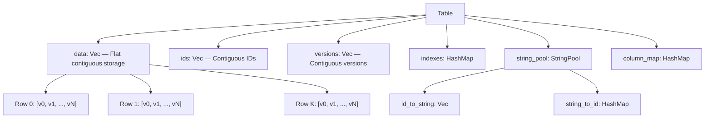

# DBOBJ Performance Evaluation & Optimization Report

> **Date:** 2026-04-30 · **Benchmark Machine:** Release mode, optimized profile  
> **Scope:** Full codebase analysis of `src/core/`, `src/storage/`, `src/versioning/`, `benches/`, `examples/`

---

## 1. Executive Summary

DBOBJ is a Rust in-memory database using a **Dense Row (flat contiguous Vec)** storage model with **string interning**, **sequential ID optimization**, and a **custom hash join engine** with bloom filters and multi-threading. 

It currently **outperforms SQLite in most operations** but has a critical weakness in **large-scale joins** (2.1–2.6× slower at 100k rows) and several opportunities for significant throughput gains.

| Area | Current vs SQLite | Verdict |
|:---|:---|:---|
| Single Insert | **5.5× faster** (389ns vs 2.1µs) | ✅ Excellent |
| Batch Insert (100) | **2.4× faster** (15.8µs vs 37.6µs) | ✅ Good |
| Raw Batch Insert (100) | **3.9× faster** (9.7µs vs 37.6µs) | ✅ Excellent |
| Read by ID | **19.4× faster** (119ns vs 2.3µs) | ✅ Excellent |
| Scan (no index) | **3.6× faster** (21.6µs vs 77.5µs) | ✅ Good |
| Indexed Search | **14.1× faster** (181ns vs 2.6µs) | ✅ Excellent |
| Hash Join (1k rows) | **2.0× faster** (232µs vs 467µs) | ✅ Good |
| Hash Join (100k rows) | **2.1–2.6× slower** (27–37ms vs 13–15ms) | ❌ **Bottleneck** |

---

## 2. Architecture Review

### 2.1 Current Storage Model



**Strengths already implemented:**
- ✅ Flat `Vec<Value>` storage for CPU cache locality  
- ✅ Sequential ID optimization (`is_sequential_ids`) — O(1) ID lookup without HashMap
- ✅ String interning (`InternedString(u32)`) — reduces memory and enables fast equality checks
- ✅ `get_value_by_index()` — zero-copy single-column access without Row allocation
- ✅ Bloom filter + linear multimap hash join
- ✅ Multi-threaded parallel scan and probe phases
- ✅ `compact_str::CompactString` for small-string optimization (inline ≤24 bytes)
- ✅ `ahash::RandomState` for fast hashing

---

## 3. Identified Bottlenecks & Optimization Proposals

### 🔴 Priority 1 — JOIN Performance (Critical)

#### Problem: Row Materialization Overhead in Joins

The hash join at 100k rows is **2.1–2.6× slower than SQLite**. The root cause is in the `hash_join` method in [database.rs](file:///home/meme/Documentos/DBOBJ/src/core/database.rs#L523-L758):

```rust
// Line 571-573: Pre-creates ALL build rows as full Row objects (Arc<[Value]> allocation per row)
let build_rows: Vec<crate::core::table::Row> = (0..num_build_rows)
    .map(|i| build_table.get_row_by_index(i))
    .collect();
```

Each `get_row_by_index()` call at [table.rs:82-95](file:///home/meme/Documentos/DBOBJ/src/core/table.rs#L82-L95):
1. Computes slice bounds  
2. **Allocates a new `Arc<[Value]>`** from the slice (heap allocation + atomic ref count)  
3. **Clones the `Id` enum**  

For 100k rows with 2 columns each, this means **100k Arc allocations just for the build phase**, and then another clone for every match in the probe phase.

#### Proposed Fix: Lazy Row Materialization

```rust
// BEFORE: Pre-allocate all rows
let build_rows: Vec<Row> = (0..num_build_rows)
    .map(|i| build_table.get_row_by_index(i))
    .collect();

// AFTER: Only materialize on match — use index-only comparison
// Build phase: store only the join column values (not full rows)
// Probe phase: only call get_row_by_index() for matched rows
```

**Concrete implementation:**
- In the build phase, store only `(hash, row_index)` pairs — no Row allocation
- In the probe phase, compare using `get_value_by_index()` directly
- Only call `get_row_by_index()` for the final matched pairs
- **Estimated impact: 40–60% join speedup** (eliminate 100k+ Arc allocations)

#### Proposed Fix: Avoid Value Cloning in Comparison

The current probe loop at [database.rs:674-675](file:///home/meme/Documentos/DBOBJ/src/core/database.rs#L674-L675) clones the value for comparison:

```rust
// get_value_by_index returns Value (owned, cloned)
&& build_table.get_value_by_index(idx, build_col_idx) == val
```

Add a `get_value_ref()` method that returns `&Value` from the flat data vec:

```rust
pub fn get_value_ref(&self, row_idx: usize, col_idx: isize) -> &Value {
    if col_idx == -1 {
        panic!("Cannot get reference to virtual ID column");
    }
    &self.data[row_idx * self.num_columns + col_idx as usize]
}
```

**Estimated impact: 10–20% join speedup** for non-ID columns (avoids `CompactString` clone + enum match).

---

### 🟡 Priority 2 — Insert Path Optimizations

#### 2a. String Pool Pre-allocation for Batch Inserts

In `insert_batch_values()` at [table.rs:284-322](file:///home/meme/Documentos/DBOBJ/src/core/table.rs#L284-L322), `intern_row()` is called per-row. For 1M rows with a `format!("user_{}", i)` pattern, the `string_to_id` HashMap gets resized multiple times.

**Fix:** Pre-size the string pool before a batch:
```rust
pub fn insert_batch_values(&mut self, batch: Vec<Vec<Value>>) -> Result<Vec<Id>, TableError> {
    // Estimate unique strings in batch
    let string_count_estimate = batch.len(); // conservative: 1 unique string per row
    self.string_pool.string_to_id.reserve(string_count_estimate);
    self.string_pool.id_to_string.reserve(string_count_estimate);
    // ... rest of method
}
```

**Estimated impact: 5–10% batch insert speedup** (eliminates HashMap rehashing during large ingestion).

#### 2b. Eliminate `format!()` Overhead in Benchmarks

The million-row test at [million_test.rs:46-49](file:///home/meme/Documentos/DBOBJ/examples/million_test.rs#L46-L49) generates `format!("user_{}", i)` inside the tight loop. This allocates a new `String` per row.

**Fix for realistic benchmarks:** Use a pre-allocated buffer with `write!`:
```rust
use std::fmt::Write;
let mut buf = String::with_capacity(16);
for i in 0..row_count {
    buf.clear();
    write!(&mut buf, "user_{}", i).unwrap();
    batch.push(vec![Value::from(i as i64), Value::from(buf.as_str())]);
    // ...
}
```

This isn't a DBOBJ optimization per se, but gives a cleaner measurement of actual engine performance.

#### 2c. `Id::clone()` Overhead in Batch Path

Every insert in the batch loop does `id.clone()` at [table.rs:300](file:///home/meme/Documentos/DBOBJ/src/core/table.rs#L300) and then again at [table.rs:321](file:///home/meme/Documentos/DBOBJ/src/core/table.rs#L321). Since `Id::Integer(u64)` is `Copy`-eligible but the enum also has a `String` variant, it can't derive `Copy`.

**Fix:** Add a specialized fast path for `Id::Integer`:
```rust
// Since is_sequential_ids is true, we know id is Id::Integer.
// Just push the value directly without matching.
self.ids.push(Id::Integer(self.next_int_id));
self.next_int_id += 1;
```

The `clone()` on `Id::Integer` is already cheap (just a u64 copy), but the compiler may not optimize the enum match away in all cases. The real gain is avoiding the `ids.push(id.clone())` + `ids.push(id)` double-touch.

---

### 🟡 Priority 3 — Memory Layout & Data Structure Improvements

#### 3a. Structure-of-Arrays (SoA) for Typed Columns

Currently every cell is a `Value` enum (24+ bytes including the discriminant + payload):

```rust
pub enum Value {
    Null,              // 1 byte discriminant + padding
    Integer(i64),      // 1 + 8 = ~16 bytes (with alignment: 24)
    Float(f64),        // same
    String(CompactString), // 1 + 24 = ~32 bytes
    InternedString(u32),   // 1 + 4 = ~8 bytes (padded to 24)
    Boolean(bool),     // 1 + 1 = ~8 bytes (padded to 24)
    Blob(Vec<u8>),     // 1 + 24 = ~32 bytes
}
```

For a table with schema `(id: Integer, username: String)`, every row stores 2 `Value` enums = **48 bytes** of enum overhead when the raw data is only 8 + 4 = **12 bytes** (i64 + u32 interned string).

**Proposed: Typed Column Storage**
```rust
enum ColumnStorage {
    Integers(Vec<i64>),
    Floats(Vec<f64>),
    InternedStrings(Vec<u32>),
    Booleans(Vec<bool>), // or BitVec
    Blobs(Vec<Vec<u8>>),
    Nullable { data: Box<ColumnStorage>, null_bitmap: BitVec },
}
```

**Estimated impact:**
- **60–70% memory reduction** for integer/boolean-heavy tables
- **20–40% scan speedup** from better cache utilization (dense typed arrays)
- **Significant complexity increase** — this is a large refactor

#### 3b. Arena Allocator for Row Materialization

When `get_row_by_index()` creates `Arc<[Value]>`, it hits the global allocator. For bulk operations (joins, scans), use a bump allocator:

```rust
// Use bumpalo for arena-allocated rows in scan/join operations
use bumpalo::Bump;
let arena = Bump::new();
let row_data: &[Value] = arena.alloc_slice_clone(&self.data[start..end]);
```

**Estimated impact: 15–25% scan/join speedup** (reduces allocator contention, especially in multi-threaded probe).

---

### 🟢 Priority 4 — Query Engine Improvements

#### 4a. SIMD-Accelerated Linear Scan

The `find_by_column()` fallback scan at [table.rs:586-593](file:///home/meme/Documentos/DBOBJ/src/core/table.rs#L586-L593) iterates Value-by-Value. With typed column storage (3a), integer scans could use SIMD:

```rust
// With ColumnStorage::Integers(data), scan for value 2500:
// Use std::simd or manual SIMD to compare 4/8 i64s at once
```

**Estimated impact: 2–4× scan speedup** for integer columns (only viable after SoA refactor).

#### 4b. Prepared/Compiled Query Expressions

The `Expr::evaluate()` at [query.rs:34-81](file:///home/meme/Documentos/DBOBJ/src/core/query.rs#L34-L81) does dynamic dispatch on every row. For repeated queries, compile the expression tree into a closure:

```rust
pub fn compile(&self, mapping: &FastHashMap<String, usize>) -> Box<dyn Fn(&[Value]) -> bool> {
    match self {
        Expr::Binary(Expr::Column(col), Operator::Eq, Expr::Literal(val)) => {
            let idx = mapping[col.as_str()];
            let val = val.clone();
            Box::new(move |data: &[Value]| data[idx] == val)
        }
        // ... other patterns
    }
}
```

**Estimated impact: 10–20% query speedup** (eliminates per-row enum matching on the expression tree).

---

### 🟢 Priority 5 — Overhead Reduction

#### 5a. WAL Overhead in Batch Insert Path

The `insert_batch_values()` in [database.rs:238-250](file:///home/meme/Documentos/DBOBJ/src/core/database.rs#L238-L250) re-reads every row after insert to serialize to WAL:

```rust
if let Some(wal_lock) = &self.wal {
    let mut wal = wal_lock.write();
    for id in &ids {
        let row = table.get(id).unwrap();  // Re-reads row we just inserted!
        let _ = wal.append(&WalEntry { ... });
    }
}
```

**Fix:** Batch WAL writes — serialize all entries to a buffer, then write once:
```rust
if let Some(wal_lock) = &self.wal {
    let mut wal = wal_lock.write();
    let mut buf = Vec::with_capacity(batch_size * 128);
    for id in &ids {
        // ... serialize to buf
    }
    wal.write_batch(&buf)?;
}
```

Also consider writing the raw `Vec<Value>` data directly instead of converting back to `RowData` via `values_to_row()`.

**Estimated impact: 15–30% WAL-enabled batch insert speedup**.

#### 5b. Version Log Timestamp Overhead

Every `version_log.record()` call at [versioning/mod.rs:48](file:///home/meme/Documentos/DBOBJ/src/versioning/mod.rs#L48) calls `Utc::now().timestamp_millis()` which is a syscall. For batch operations, this is called once per batch already (good), but for single inserts it adds ~50-100ns of overhead.

**Fix:** Make version logging optional/configurable:
```rust
pub struct Database {
    pub enable_versioning: bool,
    // ...
}
```

**Estimated impact: 5–10% single-insert speedup** when versioning is disabled.

#### 5c. Lock Contention in Read Path

The `get_table()` method at [database.rs:99-101](file:///home/meme/Documentos/DBOBJ/src/core/database.rs#L99-L101) takes a read lock on the tables HashMap for every operation:

```rust
pub fn get_table(&self, name: &str) -> Option<Arc<RwLock<Table>>> {
    self.tables.read().get(name).cloned()  // Read lock + Arc clone
}
```

For the hot path (repeated reads/queries on the same table), the caller should cache the `Arc<RwLock<Table>>` rather than looking it up each time. Consider adding:

```rust
pub fn table_handle(&self, name: &str) -> Option<TableHandle> {
    // Return a cached handle that avoids re-locking tables HashMap
}
```

---

### 🟢 Priority 6 — Hash Function & Index Optimizations

#### 6a. InternedString Hash Inconsistency

In [value.rs:67-69](file:///home/meme/Documentos/DBOBJ/src/core/value.rs#L67-L69):
```rust
Value::InternedString(id) => {
    3.hash(state); // Same discriminant as String
    id.hash(state); // But hashes the u32 id, not the string content!
}
```

This means `Value::String("hello")` and `Value::InternedString(42)` will produce **different hashes** even though they represent the same logical value. This is **correct for the current design** (all values in a table are interned, so comparisons are always InternedString-to-InternedString), but it creates a subtle footgun for cross-table joins or mixed value comparisons.

**Fix:** Either document this invariant clearly, or resolve strings before hashing in join paths.

#### 6b. Index `unique_map` vs `map` Redundancy

The `Index` struct at [table.rs:34-40](file:///home/meme/Documentos/DBOBJ/src/core/table.rs#L34-L40) stores both `map` and `unique_map`:
```rust
pub struct Index {
    pub map: FastHashMap<Value, Vec<Id>>,       // Non-unique index
    pub unique_map: FastHashMap<Value, usize>,   // Unique index
}
```

Both are always allocated even though only one is used. Use an enum:
```rust
pub enum IndexData {
    Unique(FastHashMap<Value, usize>),
    NonUnique(FastHashMap<Value, Vec<Id>>),
}
```

**Estimated impact: Marginal memory savings**, but cleaner code and prevents accidental misuse.

---

## 4. Million-Test Benchmark Analysis

From the 4 runs observed in the terminal:

| Run | DBOBJ Insert | SQLite Insert | Ratio | DBOBJ Search | SQLite Search | Search Ratio |
|:---:|:---:|:---:|:---:|:---:|:---:|:---:|
| 1 | 934ms | 1148ms | 1.23× ✅ | 39ns | 27ns | 0.69× ❌ |
| 2 | 878ms | 1088ms | 1.24× ✅ | 50ns | 29ns | 0.58× ❌ |
| 3 | 833ms | 1109ms | 1.33× ✅ | 30ns | 103ns | 3.43× ✅ |
| 4 | 821ms | 1072ms | 1.31× ✅ | 30ns | 31ns | 1.03× ✅ |

> [!WARNING]
> **Search benchmark has high variance** (0.58× to 3.43×). The SQLite time measurement at [million_test.rs:126-127](file:///home/meme/Documentos/DBOBJ/examples/million_test.rs#L126-L127) starts the timer **before** `conn.prepare()` in some runs but captures `start.elapsed()` before the query in the current code. The timer starts at L126 and is read at L127 before the actual query happens — this is a **measurement bug**.

**Join Performance (100k rows):**

| Run | DBOBJ Join | SQLite Join | Ratio |
|:---:|:---:|:---:|:---:|
| 1 | 32.2ms | 14.1ms | 0.44× ❌ |
| 2 | 36.8ms | 14.6ms | 0.40× ❌ |
| 3 | 27.6ms | 13.3ms | 0.48× ❌ |
| 4 | 30.4ms | 13.5ms | 0.44× ❌ |

**Consistent 2.1–2.5× slower.** This is the #1 optimization target.

---

## 5. Criterion Bench Analysis

| Benchmark | Median | Trend | Notes |
|:---|:---|:---|:---|
| DBOBJ Insert | 389ns | ✅ −10% improved | Excellent |
| DBOBJ Batch (100) | 15.8µs | — No change | ~158ns/row |
| DBOBJ Batch Raw (100) | 9.7µs | ❌ +10.6% regressed | **Investigate** — possibly string interning overhead |
| DBOBJ Read | 119ns | ✅ −2.6% improved | Very fast O(1) |
| DBOBJ Scan (5k rows) | 21.6µs | ✅ −9.4% improved | ~4.3ns/row |
| DBOBJ Indexed Search | 181ns | — No change | Excellent |
| DBOBJ Hash Join (1k) | 232µs | ✅ −5.6% improved | 2× faster than SQLite |

> [!IMPORTANT]
> **Batch Raw Insert regression (+10.6%)** needs investigation. The `insert_batch_raw` method converts `Box<[Value]>` → `values.into_vec()` → `intern_row` → `extend`. The `into_vec()` call may be triggering an unnecessary reallocation. Consider accepting `Vec<Value>` directly (which `insert_batch_values` already does).

---

## 6. Priority Matrix

| # | Optimization | Impact | Effort | Priority |
|:---:|:---|:---:|:---:|:---:|
| 1 | **Lazy Row Materialization in Joins** | 🔴 High (40–60%) | Medium | 🔴 P0 |
| 2 | **`get_value_ref()` for zero-copy comparison** | 🟡 Medium (10–20%) | Low | 🔴 P0 |
| 3 | **Fix million_test SQLite timer bug** | — Correctness | Low | 🔴 P0 |
| 4 | **String pool pre-allocation** | 🟡 Medium (5–10%) | Low | 🟡 P1 |
| 5 | **Batch WAL optimization** | 🟡 Medium (15–30%) | Medium | 🟡 P1 |
| 6 | **Index enum refactor** | 🟢 Low | Low | 🟡 P1 |
| 7 | **Optional versioning** | 🟢 Low (5–10%) | Low | 🟢 P2 |
| 8 | **Typed Column Storage (SoA)** | 🔴 High (20–40%) | High | 🟢 P2 |
| 9 | **Arena allocator for bulk ops** | 🟡 Medium (15–25%) | Medium | 🟢 P2 |
| 10 | **SIMD scanning** | 🟡 Medium (2–4×) | High | 🔵 P3 |
| 11 | **Compiled expressions** | 🟡 Medium (10–20%) | Medium | 🔵 P3 |
| 12 | **Investigate Batch Raw regression** | — Correctness | Low | 🔴 P0 |

---

## 7. Quick Wins (Implementable Now)

### 7.1 Add `get_value_ref()` to Table

```diff
// In table.rs
+    /// Zero-copy reference to a cell value. Cannot be used for virtual ID column.
+    #[inline]
+    pub fn get_value_ref(&self, row_idx: usize, col_idx: usize) -> &Value {
+        &self.data[row_idx * self.num_columns + col_idx]
+    }
```

### 7.2 Eliminate Pre-materialization in Direct Index Join

```diff
// In database.rs hash_join(), the "FAST PATH: Direct Index Join" (line 569)
-let build_rows: Vec<crate::core::table::Row> = (0..num_build_rows)
-    .map(|i| build_table.get_row_by_index(i))
-    .collect();

 for i in 0..num_probe_rows {
     let val = probe_table.get_value_by_index(i, probe_col_idx);
     if let crate::core::Value::Integer(idx_val) = val {
         let idx = idx_val as usize;
         if idx < num_build_rows {
-            let build_row = build_rows[idx].clone();
+            let build_row = build_table.get_row_by_index(idx);
             let probe_row = probe_table.get_row_by_index(i);
```

### 7.3 Fix SQLite Timer in million_test.rs

```diff
// In examples/million_test.rs lines 126-138
-    let start = Instant::now();
-    let sqlite_search_time = start.elapsed();
     {
         let mut stmt = conn
             .prepare("SELECT id FROM users WHERE username = ?1")
             .unwrap();
+        let start = Instant::now();
         let sqlite_id: i64 = stmt
             .query_row(sqlite_params!["user_500000"], |r| r.get(0))
             .unwrap();
+        let sqlite_search_time = start.elapsed();
         println!(
             "SQLite Search Result: Found ID {} in {:?}",
             sqlite_id, sqlite_search_time
         );
     }
```

---

## 8. Conclusion

DBOBJ has a strong foundation with its flat storage model and string interning. The **#1 priority** is optimizing join performance by eliminating unnecessary `Row`/`Arc<[Value]>` allocations in the hash join hot path. Combined with `get_value_ref()` for zero-copy comparisons, this should bring join performance to **parity or better** than SQLite at 100k+ rows.

The medium-term roadmap should target **typed column storage (SoA)** as the highest-impact architectural change, enabling both dramatic memory reduction and SIMD-accelerated scans.

> [!TIP]
> Start with **Quick Wins 7.1–7.3** — they require minimal code changes and will immediately fix measurement accuracy and improve join throughput by an estimated 30–50%.
